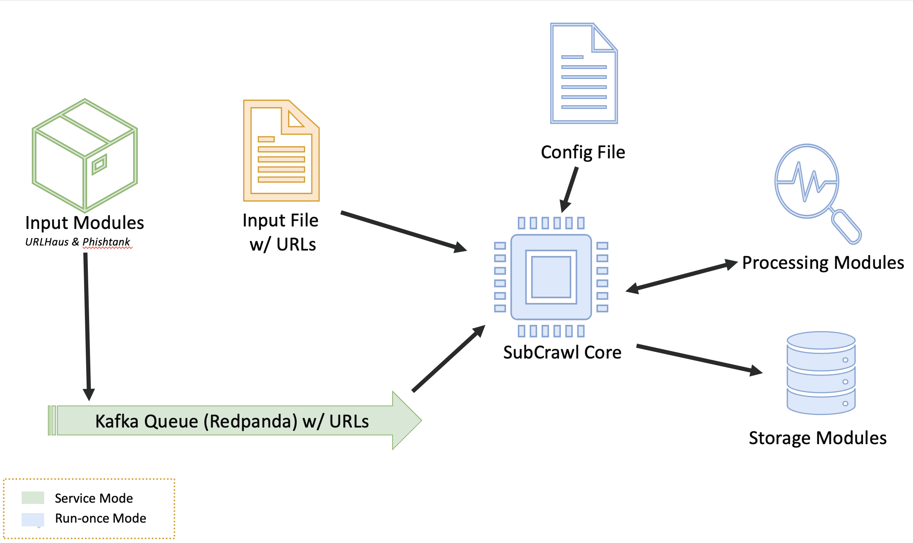
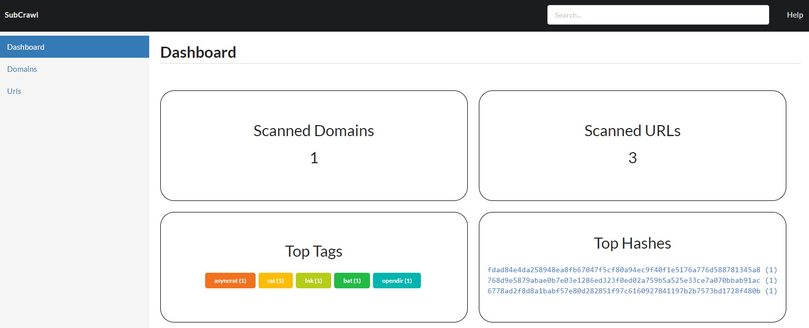
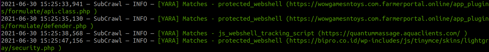
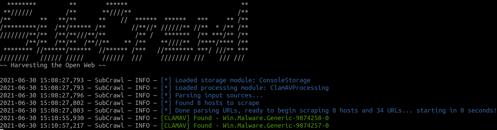
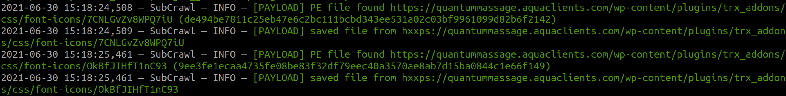
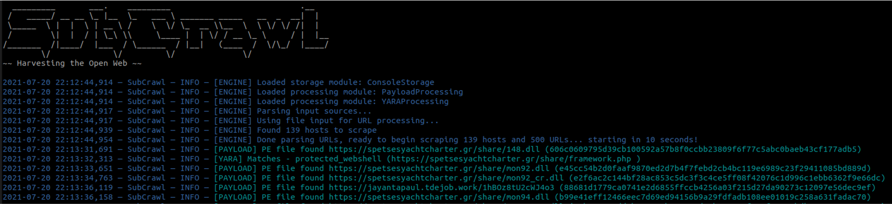
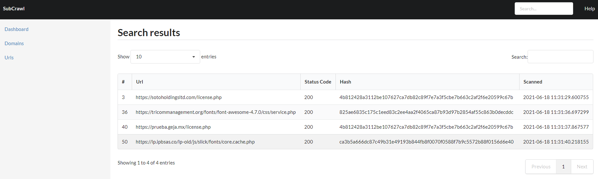
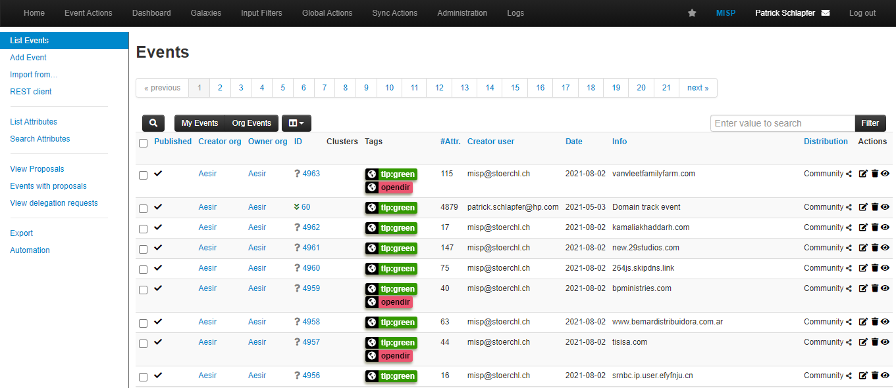

# SubCrawl

SubCrawl is a framework developed by [Patrick Schläpfer](https://twitter.com/stoerchl), [Josh Stroschein](https://twitter.com/jstrosch) and [Alex Holland](https://twitter.com/cryptogramfan) of HP Inc’s [Threat Research](https://threatresearch.ext.hp.com/blog/) team. SubCrawl is designed to find, scan and analyze open directories. The framework is modular, consisting of four components: input modules, processing modules, output modules and the core crawling engine. URLs are the primary input values, which the framework parses and adds to a queuing system before crawling them. The parsing of the URLs is an important first step, as this takes a submitted URL and generates additional URLs to be crawled by removing sub-directories, one at a time until none remain. This process ensures a more complete scan attempt of a web server and can lead to the discovery of additional content. Notably, SubCrawl does not use a brute-force method for discovering URLs. All the content scanned comes from the input URLs, the process of parsing the URL and discovery during crawling. When an open directory is discovered, the crawling engine extracts links from the directory for evaluation. The crawling engine determines if the link is another directory or if it is a file. Directories are added to the crawling queue, while files undergo additional analysis by the processing modules. Results are generated and stored for each scanned URL, such as the SHA256 and fuzzy hashes of the content, if an open directory was found, or matches against YARA rules. Finally, the result data is processed according to one or more output modules, of which there are currently three. The first provides integration with MISP, the second simply prints the data to the console, and the third stores the data in an SQLite database. Since the framework is modular, it is not only easy to configure which input, processing and output modules are desired, but also straightforward to develop new modules. 


_Figure 1 - SubCrawl architecture_

SubCrawl supports two different modes of operation. First, SubCrawl can be started in a run-once mode. In this mode, the user supplies the URLs to be scanned in a file where each input value is separated by a line break. The second mode of operation is service mode. In this mode, SubCrawl runs in the background and relies on the input modules to supply the URLs to be scanned. Figure 1 shows an overview of SubCrawl’s architecture. The components that are used in both modes of operation are blue, run-once mode components are yellow, and service mode components are green.

## Requirements

Based on the chosen run mode, other preconditions must be met.

### Run-Once Mode Requirements

SubCrawl is written in Python3. In addition, there are several packages that are required before running SubCrawl. The following command can be used to install all required packages before running SubCrawl. From the *crawler* directory, run the following command:

```
$ sudo apt install build-essential
$ pip3 install -r requirements.txt
```

### Service Mode Requirements

If SubCrawl is started in service mode, this can be done using Docker. For this reason, the installation of Docker and Docker Compose is required. Good installation instructions for this can be found directly on the Docker.com website.
- [Installing Docker Engine](https://docs.docker.com/engine/install/ubuntu/)
- [Installing Docker Compose](https://docs.docker.com/compose/install/)

## Getting Help

SubCrawl has built-in help through the _-h/--help_ argument or by simply executing the script without any arguments.

```
  ********         **        ******                               **
 **//////         /**       **////**                             /**
/**        **   **/**      **    //  ******  ******   ***     ** /**
/*********/**  /**/****** /**       //**//* //////** //**  * /** /**
////////**/**  /**/**///**/**        /** /   *******  /** ***/** /**
       /**/**  /**/**  /**//**    ** /**    **////**  /****/**** /**
 ******** //******/******  //****** /***   //******** ***/ ///** ***
////////   ////// /////     //////  ///     //////// ///    /// /// 
~~ Harvesting the Open Web ~~

usage: subcrawl.py [-h] [-f FILE_PATH] [-k] [-p PROCESSING_MODULES] [-s STORAGE_MODULES]

optional arguments:
  -h, --help            show this help message and exit
  -f FILE_PATH, --file FILE_PATH
                        Path of input URL file
  -k, --kafka           Use Kafka Queue as input
  -p PROCESSING_MODULES, --processing PROCESSING_MODULES
                        Processing modules to be executed comma separated.
  -s STORAGE_MODULES, --storage STORAGE_MODULES
                        Storage modules to be executed comma separated.

  Available processing modules: 
  - ClamAVProcessing
  - JARMProcessing
  - PayloadProcessing
  - TLSHProcessing
  - YARAProcessing

  Available storage modules: 
  - ConsoleStorage
  - MISPStorage
  - SqliteStorage
```

## Run-Once Mode

This mode is suitable if you want to quickly scan a manageable amount of domains. For this purpose, the URLs to be scanned must be saved in a file, which then serves as input for the crawler. The following is an example of executing in run-once mode, not the _-f_ argument is used with a path to a file.

```
python3 subcrawl.py -f urls.txt -p YARAProcessing,PayloadProcessing -s ConsoleStorage
```

## Service Mode

With the service mode, a larger amount of domains can be scanned and the results saved. Based on the selected storage module, the data can then be analyzed and evaluated in more detail. To make running the service mode as easy as possible for the user, we built all the functionalities into a Docker image. In service mode, the domains to be scanned are obtained via Input modules. By default, new malware and phishing URLs are downloaded from [URLhaus](https://urlhaus.abuse.ch/) and [PhishTank](https://www.phishtank.com/) and queued for scanning. The desired processing and storage modules can be entered directly in the `config.yml`. By default, the following processing modules are activated, utilizing the SQLite storage:
- ClamAVProcessing
- JARMProcessing
- TLSHProcessing
- YARAProcessing

In addition to the SQLite storage module, a simple web UI was developed that allows viewing and managing the scanned domains and URLs. 



However, if this UI is not sufficient for the subsequent evaluation of the data, the MISP storage module can be activated alternatively or additionally. The corresponding settings must be made in `config.yml` under the `MISP` section. 

The following two commands are enough to clone the GIT repository, create the Docker container and start it directly. Afterwards the web UI can be reached at the address `https://localhost:8000/`. Please note, once the containers have started the input modules will begin to add URLs to the processing queue and the engine will begin crawling hosts.


```
git clone https://github.com/hpthreatresearch/subcrawl.git

docker-compose up --build 
```

## SubCrawl Modules

### Input Modules

Input modules are only used in service mode. If SubCrawl started using the run-once mode then a file containing the URLs to scan must be supplied. The following two input modules have been implemented.

#### URLhaus

[URLhaus](https://urlhaus.abuse.ch/) is a prominent web service tracking malicious URLs. The web service also provides exports containing new detected URLs. Those malware URLs serve as perfect input to our crawler as we mainly want to analyze malicious domains. Recently submitted URLS are retrieved and search results are not refined through the API request (i.e. through tags or other parameters available). The HTTP request made in this [input module](crawler/input/urlhaus.py) to the URLHaus API can be modifed to further refine the results obtained. 

#### PhishTank

[PhishTank](https://www.phishtank.com/) is a website that collects phishing URLs. Users have the possibility to submit new found phishing pages. An export with active phishing URLs can be generated and downloaded from this web service via API. So this is also an ideal collection for our crawler.

### Processing Modules

SubCrawl comes with several processing modules. The processing modules all follow similar behavior on how they provide results back to the core engine. If matches are found, results are returned to the core engine and later provided to the storage modules.  Below is a list of processing modules.

#### SDHash

The [SDHash](https://github.com/sdhash/sdhash) processing modue is used to calculate a similarity hash of the HTTP response. The minimum size of the content must is 512 bytes to be able to successfully calculate a hash. This is probably the most complicated processing module to install, as it requires Protobuf and depending on the target host it must be recompiled. Therefore this processing module is deactivated by default. An already compiled version can be found in crawler/processing/minisdhash/ which requires protobuf-2.5.0 and python3.6. Those binaries were compiled on an Ubuntu 18.04.5 LTS x64. Following the installation instructions:

```
# Protobuf installation
> apt-get update
> apt-get -y install libssl-dev libevent-pthreads-2.1-6 libomp-dev g++
> apt-get -y install autoconf automake libtool curl make g++ unzip
> wget https://github.com/protocolbuffers/protobuf/releases/download/v2.5.0/protobuf-2.5.0.zip
> unzip protobuf-2.5.0.zip
> cd protobuf-2.5.0
> ./configure
> make
> sudo make install

# Python3.6 installation
> apt-get install python3.6-dev
> sudo ldconfig

# SDHash installation
> git clone https://github.com/sdhash/sdhash.git
> cd sdhash
> make
> make install
> ldconfig
```


#### JARM

[JARM](https://github.com/salesforce/jarm)  is a tool that fingerprints TLS connections developed by Salesforce. The JARM processing module performs a scan of the domain and returns a JARM hash with the domain to the core engine. Depending on the configuration of a web server, the TLS handshake has different properties. By calculating a hash of the attributes of this handshake, these differences can be used to track web server configurations. 

#### TLSH

The [TLSH](https://github.com/trendmicro/tlsh) processing module is similar to the SDHash processing module used to calculate a similarity hash. The advantage of the TLSH is, that the installation is much simpler and the input minium is smaller with 50 bytes. As most webshell logins are rather small and were the focus of our research, we activated this processing module by default.

#### YARA

The YARA processing module is used to scan HTTP response content with YARA rules. To invoke this processing module, provide the value *YARAProcessing* as a processing module argument. For example, the following command will load the YARA processing module and produce output to the console via the ConsoleStorage storage module.

```
python3 subcrawl.py -p YARAProcessing -s ConsoleStorage
```

Currently, the YARA processing module is used to identify webshell logins and various other interesting content. YARA rules included with this project:

* protected_webshell: Identifies login pages of password-protected webshells
* js_webshell_tracking_script: Identifies backdoored plugins/themes that use JavaScript 
to notifies the attacker when the webshell becomes active
* open_webshell: Identifies open webshells (i.e. webshells that are not protected via login)
* php_webshell_backend: Identifies PHP webshell backend used by the attacker

Sample output:


To add additional YARA rules, you can add .YAR files to the *yara-rules* folder, and then include the rule file by adding an *include* statement to *combined-rules.yar*.

#### ClamAV

The ClamAV processing module is used to scan HTTP response content during scanning with ClamAV. If a match is found, it is provided to the various output modules. To invoke this processing module, provide the value *ClamAVProcessing* as a processing module argument. For example, the following command will load the ClamAV processing module and produce output to the console via the ConsoleStorage storage module.

```
python3 subcrawl.py -p ClamAVProcessing -s ConsoleStorage
```

Sample output:


To utilize this module, ClamAV must be installed. From a terminal, install ClamAV using the APT package manager:

```
$ sudo apt-get install clamav-daemon clamav-freshclam clamav-unofficial-sigs
```
Once installed, the ClamAV update service should already be running. However, if you want to manually update using *freshclam*, ensure that the service is stopped:
```
sudo systemctl stop clamav-freshclam.service
```
And then run *freshclam* manually:
```
$ sudo freshclam
```
Finally, check the status of the ClamAV service:
```
$ sudo systemctl status clamav-daemon.service
```
If the service is not running, you can  use *systemctl* to start it:
```
$ sudo systemctl start clamav-daemon.service
```

#### Payload

The Payload processing module is used to identify HTTP response content using the *libmagic* library. Additionally, SubCrawl can be configured to save content of interest, such as PE files or archives. To invoke this processing module, provide the value *PayloadProcessing* as a processing module argument. For example, the following command will load the Payload processing module and produce output to the console:

```
python3 subcrawl.py -p PayloadProcessing -s ConsoleStorage
```

There are no additional dependencies for this module. 

Sample output:



### Storage Modules

Storage modules are called by the SubCrawl engine after all URLs from the queue have been scanned. They were designed with two objectives in mind. First, to obtain the results from scanning immediately after finishing the scan queue and secondly to enable long-term storage and analysis. Therefore we not only implemented a ConsoleStorage module but also an integration for MISP and an SQLite storage module. 

#### Console

To quickly analyse results directly after scanning URLs, a well-formatted output is printed to the console. This output is best suited for when SubCrawl is used in run-once mode. While this approach worked well for scanning single domains or generating quick output, it is unwieldy for long-term research and analysis.



#### SQLite

Since the installation and configuration of MISP can be time-consuming, we implemented another module which stores the data in an SQLite database. To present the data to the user as simply and clearly as possible, we also developed a simple web GUI. Using this web application, the scanned domains and URLs can be viewed and searched with all their attributes. Since this is only an early version, no complex comparison features have been implemented yet.



#### MISP

[MISP](https://www.misp-project.org/) is an open-source threat intelligence platform with a flexible data model and API to store and analyze threat data. SubCrawl stores crawled data in MISP events, publishing one event per domain and adding any identified open directories as attributes. MISP also allows users to define tags for events and attributes. This is helpful for event comparison and link analyses. Since this was one of our primary research goals, we enriched the data from URLHaus when exporting SubCrawl’s output to MISP. URLHaus annotates its data using tags which can be used to identify a malware family or threat actor associated with a URL. For each open directory URL, the module queries locally-stored URLHaus data and adds URLHaus tags to the MISP event if they match. To avoid having a collection of unrelated attributes for each MISP event, we created a new MISP object for scanned URLs, called opendir-url. This ensures that related attributes are kept together, making it easier to get an overview of the data.



## Building your own Modules

Templates for processing and storage modules are provided as part of the framework.

### Processing Modules

Processing modules can be found under `crawler->processing` and a sample module file `example_processing.py` found in this directory. The template provides the necessary inheritance and imports to ensure execution by the framework. The _init_ function provides for module initialization and receives an instance of the logger and the global configuration. The logger is used to provide logging information from the processing modules, as well as throughout the framework.

The _process_ function is implemented to process each HTTP response. To this end, it receives the URL and the raw response content. This is where the work of the module is implemented. This function should return a dictionary with the following fields:

- hash: the sha256 of the content
- url: the URL the content was retrieved from
- matches: any matching results in the module, For example, libmagic or YARA results.

A unique class name must be defined and is used to define this module when including it via the _-p_ argument or as a default processing module in the configuration file.

Finally, add an import statement in [`__init__.py`](crawler/processing/__init__.py), using your class name:

```
from .<REPLACE>_processing import <REPLACE>Processing
```

### Storage Modules

Storage modules can be found under `crawler->storage` and a sample module file `example_storage.py` found in this directory. Similar to the processing modules, _init_ function provides for module initialization and receives an instance of the logger and the global configuration. The _store_results_ function receives structured data from the engine at intervals defined by the batch size in the configuration file.

A unique class name must be defined and is used to load the module when including it via the _-s_ argument or as a default processing module in the configuration file.

## Presentations and Other Resources

2021:

- [BlackHat Arsenal USA](https://www.blackhat.com/us-21/arsenal/schedule/index.html#introducing-subcrawl-a-framework-for-the-analysis-and-clustering-of-hacking-tools-found-using-open-directories-24081)
- [VirusBulletin Localhost - Upcoming](https://vblocalhost.com/presentations/introducing-subcrawl-a-framework-for-the-analysis-and-clustering-of-hacking-tools-found-using-open-directories)

## License
SubCrawl is licensed under the MIT license
