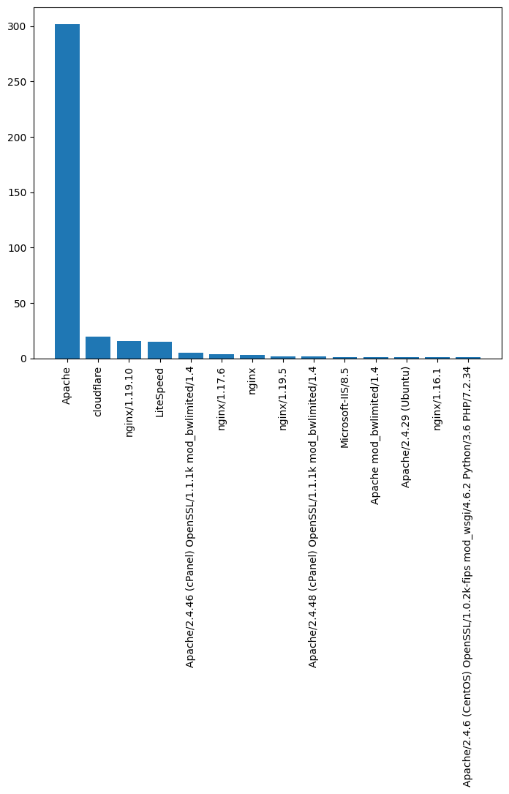
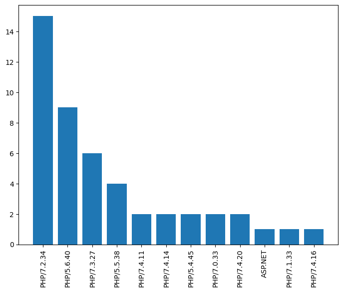

## Analysis Scripts

For the developed case study in the associated paper, we made a wide variety of data analyses. On the one hand we used MISP integrated functionalities and on the other hand we developed our own scripts, which provide us with the results.

In this folder we provide the scripts used for this purpose. 

### tlsh_analysis.py

This script creates a correlation graph from known webshell logins based on the previously calculated TLSH hash. It can be seen that although there are eight different webshell logins, only three clusters result due to TLSH similarity. An example result of this script can be found below.


### webserver_analysis.py

In order to find a possible compromise path of the analyzed websites, we tried to evaluate the used web servers. We looked at the HTTP response header and saved the returned web servers including versions. The analysis shows that only a few websites return the actual version of the web server. However, it also shows that a wide variety of versions and technologies are in use. This makes a large-scale compromise of websites with only a few exploits rather unlikely.



### scripting_technology_analysis.py

Looking for an answer to the same questions, we have created a similar evaluation for the used scripting technology as well. Here, too, it can be seen that a wide variety of technologies and versions are used. Therefore, a large-scale compromise with only a few exploits is rather unlikely in this case as well.




### url_analysis.py

With the URL analysis script we wanted to extract two properties from the webshell URLs. On the one hand we were interested in the used names of the webshell logins and on the other hand the plugin names, in case Wordpress is used as CMS. It is noticeable that the used webshell login names always look very similar. We have found many different plugins with this evaluation. This means that exploiting a vulnerability in a plugin is again rather unlikely. An excerpt of the results can be found below.

```
******** Common Webshell names **************
Name                                      Num
license.php                               44
api.cache.php                             14
options.php                               13
library.php                               12
app.lib.php                               11
class.view.php                            11
app.api.php                               11
lib.core.php                              11
core.cache.php                            11
api.class.php                             10
core.lib.php                              10
include.php                               9
```

```
******** Common Wordpress Plugins ***********
Plugin                                    Num
jetpack                                   8
wordpress-seo                             6
woocommerce                               6
elementor                                 4
charmap                                   4
contact-form-7                            3
kirki                                     3
js_composer                               2
wpforms-lite                              2
lite-cache                                1
```

A possible theory on how websites are compromised on such a large scale can be found in our related paper.

